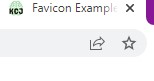

# Week \#

- [Recap]()
- [This Week]()
- [Exercise]()

## 🔙 Recap

- Comment / Annotation
- HTML - Attribute
- CSS - Intro to CSS

## 📖 This Week

- HTML
    - Favicon
    - Class
- CSS
    - Applying style to each element
- JavaScript - Intro to JavaScript
    - The HTML `<script>` Tag
    - Outlint `script.js`

## 🦴 HTML

### Favicon

#### What is Favicon?
Favicon is a small icon which is displayed next to the page title <br />
ex) <br />


#### How to add Favicon in the website?
1. Create a directory called `images` in the root directory of the website folder.
2. Move the favicon image called `favicon.ico` to the `images` directory.
3. Link the `ico` file to the HTML file by using `link` tag. <br />
ex) <br />
`favicon_example.html`

```
<!DOCTYPE html>
<html>
<head>
  <title>Favicon Example</title>
  <link rel="icon" type="image/x-icon" href="../images/favicon.ico">
</head>
<body>

<h1>This is an example for setting favicon with HTML</h1>
<p>Look at the left side of the page title!</p>

</body>
</html>
```
like this <br />


#### How to make a custom favicon?
- Favicon should have a size of 16 pixels width and height.
- Favicon should be clean and simple.
- Favicon should be able to identificable which provides good visual indicator.

> Use [this website](https://favicon.io/) for converting images with various extension to `ico` extension.


## 🏠 Exercise