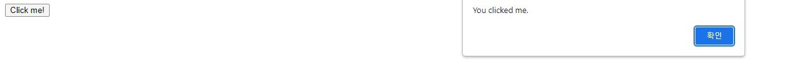

# Week 6

- [Recap]()
- [This Week]()
- [Exercise]()

## 🔙 Recap

- HTML
    - Favicon
    - Class Attribute
- CSS
    - Applying style to each element
- JavaScript - Intro to JavaScript
    - The HTML `<script>` Tag
    - Inline `script.js`

## 📖 This Week
### 🌟🌟Very Important🌟🌟
- HTML
    - Layout Elements and Techniques (div & span tag)
- Link JavaScript
- JavaScript Programming
    - Variables
    - Conditional Statement
    - For loop (While loop)

## 🦴 HTML
### In order to make a good website, you need to design it well from the beginning so that you don't have to modify it much later. 
> ex) Architectural Design

The design can be like
<p align='center'></p>

To make this as a code, you need the following tags
### - div tag
```
You can use it to group large sections as a block and can be formatted (Presentation of block) using Style Sheet (CSS) in your document.
```
### - semantic tags
```
Semantic elements of HTML5, the name clearly defines what kind of code it is holding, and it is for which part of the website.
Therefore, it helps you understand what's happening where on the page.
```

- `<article>`
- **`<aside>`**: the portion which is not directly related to the main content.
- `<details>`
- `<figcaption>`
- `<figure>`
- **`<footer>`**: the portion of the end
- **`<header>`**: the portion of the start
- **`<main>`**: main portion
- `<mark>`
- **`<nav>`**: navigation bar
- `<section>`
- `<summary>`
- `<time>`

<p align='center'></p>

## 🍊 Link JavaScript (Externally)

### How to link external Javascript file to html file?
- Use `<script src ="..."></script>` tag
`<script>` tag is used to link script which is Javascript to html file.<br />

Put the tag inside the `<head>` tag with `src` attribute in your html file. <br />
For example)

`script.js`


```
function myFunc() {
    alert("You clicked me.")
}
```

`index.html`
```
<!DOCTYPE html>
<html>
    <head>
        <title>example page</title>
        <script src="./script.js"></script>
    </head>
    <body>
        <button onclick="myFunc()">Click me!</button>
    </body>
</html>
```



## 🌟🌟 JavaScript Programming 🌟🌟

- Variables
- Conditional Statement
- For loop (While loop)

### What are Variables?
```
Variables are containers for storing data
```
 for example)
<br />
You can declare variables by using `let` keyword.
> There are other keywords, for example, `var`. But, I recommend don't use this. This is for old web browser.
> You can also delcare variables without using keyword. But, try to declare with `let` keyword.

```
let a = 25; // 25 is stored in 25
let b = 75; // 75 is stroed in 75
let c = a + b; // 25 + 75 is stored in 100
```

> In most of the programming languages, you need to put `semicolon (;)` to indicate that the command is finished.

> For more information, refer `variables.js`.

### Conditional Statement
#### Boolean Variable
- `true` == 1
- `false` == 0

```
If you want the line of code to be executed conditionally, use `Conditional Statement`.
There are 4 types of Conditional Statement.
```
- `if` Statement
- `else` Statement
- `else if` Statement

#### `if` Statement
```
If the `condition` is `true`,
the `block of code` will be executed.
```
##### Syntax
```
if ([condition]) {
    [block of code]
}
```

#### `else` Statement
```
If the `condition` in the `if` statement is `false`, the `block of code` in the `else` statement will be executed.
```
##### Syntax
```
if ([condition]) {
    [block of code]
} else {
    [block of code]
}
```

#### `else if` Statement
```
If the `condition` in the `if` statement is `false` and the `condition` in the `else if` statement is `true`, run the `block of code` in the `else if` statement.
```
##### Syntax
```
if ([condition]) {
    [block of code]
} else if ([condition]) {
    [block of code]
}
```

for example) <br/>


## 🏠 Exercise