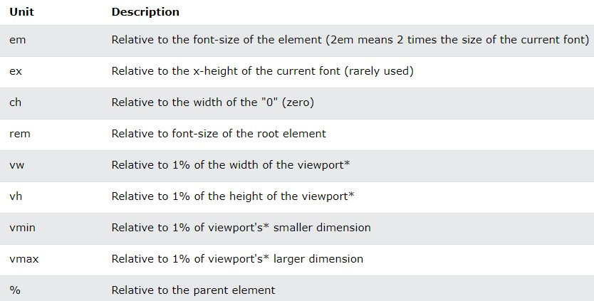
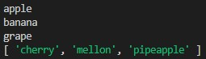

# Week 7

- [Recap](https://github.com/OfficerChul/webDev101/blob/main/Week_7/Week_7.md#-recap)
- [This Week](https://github.com/OfficerChul/webDev101/blob/main/Week_7/Week_7.md#-this-week)
- [HTML](https://github.com/OfficerChul/webDev101/blob/main/Week_7/Week_7.md#-html)
- [CSS](https://github.com/OfficerChul/webDev101/blob/main/Week_7/Week_7.md#-css)
- [JavaScript Programming](https://github.com/OfficerChul/webDev101/blob/main/Week_7/Week_7.md#-javascript-programming)
- [Exercise](https://github.com/OfficerChul/webDev101/blob/main/Week_7/Week_7.md#-exercise)

## 🔙 Recap

- HTML
    - Layout Elements and Techniques (div & span tag)
- Link JavaScript
- JavaScript Programming
    - Variables
    - Conditional Statement
    - For loop

## 📖 This Week
- HTML
    - Layout Elements and Techniques (div & span tag)
- CSS 
    - Unit (Absolute Lenghts vs Relative Lengths)
    - Flexbox
    - Apply style to `div` and `semantic` tag
- JavaScript Programming
    - While Loop
    - Array

## 🦴 HTML
### In order to make a good website, you need to design it well from the beginning so that you don't have to modify it much later. 
> ex) Architectural Design

The design can be like
<p align='center'></p>

To make this as a code, you need the following tags
### - div tag
```
1. You can use it to gather large sections as a block and group similar content together so that you can organize and style it easily.
2. (Presentation of block) using Cascading Style Sheet (CSS) in your document.
3. Div tag can also be used not only to group similar content, but also make the code be organized.
```

### - semantic tags
```
Semantic elements of HTML5, the name clearly defines what kind of code it is holding, and it is for which part of the website.
1. Therefore, it helps you understand what's happening where on the page.
2. It helps the website to have a better accessibility and Search Engine Optimization (SEO).
```

- `<article>`
- **`<aside>`**: the portion which is not directly related to the main content.
- `<details>`
- `<figcaption>`
- `<figure>`
- **`<footer>`**: the portion of the end
- **`<header>`**: the portion of the start
- **`<main>`**: main portion
- `<mark>`
- **`<nav>`**: navigation bar
- `<section>`
- `<summary>`
- `<time>`

<p align='center'></p>

### The best way to organize your website is to use both `div` tags and `semantic` tags. Try to use `semantic` tag first. If there is no content that matches `semantic` tags, then use `div` tags as alternatives.


`html_example.html`


```
<!DOCTYPE html>
<html>
    <head>
        <title>example page</title>
        <link rel='stylesheet' href="css_example.css"></link>
    </head>
    <body>
        <header>
            <h2 class = 'logo'>Officer Chul's Website</h2>
            <nav>
                <ul class = "nav">
                    <li><a href="">Home</a></li>
                    <li><a href="">About</a></li>
                    <li><a href="">Project</a></li>
                    <li><a href="">Contact</a></li>
                </ul>
            </nav>
        </header>
        <div class="home">
            <h1>Home</h1>
        </div>
        <div class="about">
            <h1>About</h1>
        </div>
        <div class="services">
            <h1>Services</h1>
        </div>
        <div class="contact">
            <h1>Contact</h1>
        </div>
        <footer>
            <h5 class="closing">Thank you for vising my website.</h5>
        </footer>
    </body>
</html>
```

## 👚 CSS 

### Unit

#### Absolute Lengths vs Relative Lengths

#### Absolute Lengths

```
Absolute lengths are the units which are fixed and has the exact size.
It is not recommended to use if you don't know which screen will be used, because the size of picture with those units will not be change with vary size of the screen.
```

<p align='center'></p>
<p align='center'>https://www.w3schools.com/cssref/css_units.asp</p>

#### Relative Lengths

```
Relative Lengths shows different size which depends on the size of other components.
```

<p align='center'></p>
<p align='center'>https://www.w3schools.com/cssref/css_units.asp</p>

### Flexbox

```
Flexbos is a web layout model which helps the user to organize and arrange elements within `container`.

It allows us to design our website more flexibly.
```

> The best website I've seen for grasping the concept of flexbox and practice flexbox: [Flexbox_Froggy](https://flexboxfroggy.com/)
<p align='center'></p>

Flexbox has two big properties: flex container vs flex items </br>
<p align='center'>
</p>
<p align='center' >https://css-tricks.com/snippets/css/a-guide-to-flexbox/</p>

```
<div class = "container">
    <h1 class='items'>item1</a></h1>
    <h1 class='items'>item2</a></h1>
    <h1 class='items'>item3</a></h1>
    <h1 class='items'>item4</a></h1>
</ul>
```

```
.container {
    display: flex
}
```

### Apply style to `div` and `semantic` tag

#### You will learn how to apply style using flexbox and units by using `div` and `semantic` tags.

`css_example.css`

```
* {
    margin: 0;
    padding: 0;
    box-sizing: border-box;
    font-family: 'Times New Roman', Times, serif;
  }

header {
    padding: 0 70px;
    display: flex;
    align-items: center;
    justify-content: space-between;
    margin-top: 20px;
    margin-bottom: 20px;
}
.nav {
    display: flex;
    justify-content: center;
    align-items: center;
    list-style-type: none;
    gap: 60px;
}

.nav li a {
  text-decoration: none;
}

div {
  display: flex;
  justify-content: center;
  align-items: center;
  padding: 60px;
  margin: 60px;
}

.home {
  background-color: aliceblue;
}

.about {
  background-color: azure;
}

.services {
  background-color: aqua;
}

.contact {
  background-color: aquamarine;
}

.closing {
  display: flex;
  justify-content: center;
  align-items: center;
  background-color: grey;
  padding: 20px;
  margin-bottom: 10px;
}
```

## 🍊 JavaScript Programming

### While Loop

```
The `block of code` in the `while loop` will be executed as long as the `condition` is `true`.
```

#### Syntax

```
while ([condition]) {
    [block of code]
}
```

for example)

```
let i = 0
while (i < 3) {
    console.log('How many time will this be printed?');
    i++;
}
consle.log('');
while (true) {
    console.log('hello world');
}
```
will output...

```
console.log('How many time will this be printed?');
console.log('How many time will this be printed?');
console.log('How many time will this be printed?');

console.log('hello world');
console.log('hello world');
console.log('hello world');
console.log('hello world');
console.log('hello world');
...
...
```

### Array
```
An array is a special variable, which can hold more than one value.
```

#### Initializing every values by mentioning the variable name

```
let fruit1 = 'apple'
let fruit2 = 'banana'
let fruit3 = 'grape'
```
#### Syntax
```
[variable type] [array name] = [elements...]
```

#### Initialize an array which contains fruits
```
let fruits = ['cherry', 'mellon', 'pipeapple']

console.log(fruit1);
console.log(fruit2);
console.log(fruit3);

console.log(fruits);
```
<p align='center'></p>

### Solve Programming Problems

`Question 1`

```
The least common multiple (L.C.M.) of two numbers is the smallest positive integer that is perfectly divisible by the two given numbers.

For example, the L.C.M. of 12 and 14 is 84.

Program to Compute LCM
```
> https://www.programiz.com/python-programming/examples/lcm

`Question 2`
```
These are the grades for the midterm 1 of class A.
Get mean, median, and standard deviation.

84, 17, 53, 100, 27, 90, 98, 95, 88, 65, 72
```

## 🏠 [Exercise](https://github.com/OfficerChul/webDev101/blob/main/Week_7/exercise/exercise.md)
