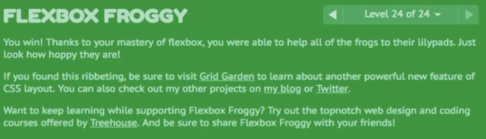

# Exercise Instruction

## 🔔 Goal

1. Get used to `flexbox`.
2. Write a code for your website for the future use of `React.js`
3. Be accustomed to the concept of the `while loop` and the `array`.

## 📑 Instruction

1. Make a directory called `Week_7`
2. Finish the flexbox_froggy game and get used to the concept of flexbox(You will use it a lot in the future).  
 
Upload the picture you get when you finish the froggy game to the folder.

3. Make your website which looks like the one you drew.
4. Finish Questions in the JavaScript Programming part in the `Week_7.md`
5. Push all the codes that you used to the `GitHub` under Week_7.

