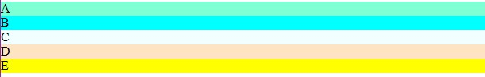
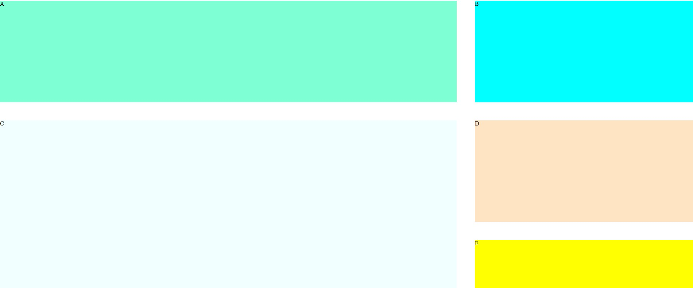
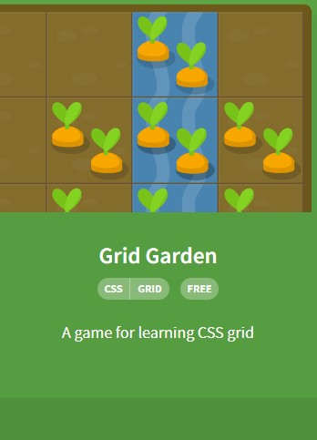

# Week 8

- [Recap]()
- [This Week]()
- [Grid]()
- [React.js]()
- [Exercise]()

## 🔙 Recap
- HTML
    - Layout Elements and Techniques (div & span tag)
- CSS 
    - Unit (Absolute Lenghts vs Relative Lengths)
    - Flexbox
    - Apply style to `div` and `semantic` tag
- JavaScript Programming
    - While Loop
    - Array
## 📖 This Week

- CSS - Grid
- React.js

## Grid

### What is Grid
```
Before building a website, think about what layout the website will have is very important.
For `tags`, you can use semantic tags, such as `header`, `nav`, `footer` or also you can use div tags to group similar contents. By using `tags`, you can think about what kind of contents you are going to have in your website.

Then, how to make a layout to align those contents in 1-D or 2-D?

- Flexbox is a one-dimentional layout system that you can often use it for aligning.

- CSS Grid Layout is a two-dimentional grid-based layout system which rows and columns makes it easier to design our website's layout.
```

### Why do we use it?
Let's say you made items in a container for grid like below (with CSS): </br>
`html_example.html`
```
<div class="container">
    <div class="item">A</div>
    <div class="item">B</div>
    <div class="item">C</div>
    <div class="item">D</div>
    <div class="item">E</div>
</div>
```
<p align='center'></p>

We want to make this to be
<p align='center'></p>

### How to use Grid?

As we define a container element as `display: flex;` for the flexbox, you also need to define it with 
```
.container {
    display: grid;
}
```

<p align='center'></p>


Once you finished defining it, there are several attributes that you can use for grid.
```
- `grid-template`
    - `grid-template-columns`
    - `grid-template-rows`
- `grid-area`
    - `grid-column`
    - `grid-row`
```

#### Terminology
<p align='center'></p>
<p align='center'>https://s952.pcdn.co/wp-content/uploads/CSS-GridCodrops-e1489291717336.png</p></br>


<p align='center'></p>
<p align='center'>https://studiomeal.com/archives/533</p>

`red-block`
```
.red-block {
    grid-row: 1/2;
    grid-column: 1/3;
    background-color: red;
}
```
`green-block`
```
.green-block {
    grid-row: 2/4;
    grid-column: 3/4;
    background-color: green;
}
```

#### [Grid Garden!!](https://cssgridgarden.com/)

<p align='center'></p>

#### Example
`html_example.html` </br>
and </br>
`css_example.css`

## React.js
<p align='center'></p>

### JavaScript Framework
```
A JavaScript library is a library of pre-written JavaScript code that allows for easier development of JavaScript-based applications.
```

- **React**
- Angular
<p align='center'></p>
- Vue
<p align='center'></p>

### What is `React.js`?
```
React is a JavaScript User Interfaces (UIs) framework which is a tool for building a website using a component-based concept.
```

> It is developed and maintained by Meta.

### Set Up Development Environment

1. We need `node.js` for using Node Package Manager (NPM)</br> 
To check if `node.js` is installed on your computer, use `node -v` command to check.
You can also check npm version by entering `npm -v`.
2. Create a folder that you want to make an app
3. Go to the folder and enter `npx create-react-app [app name]` to the path that you want to make app on terminal.
> npm stands for Node Package Execute which run NPM.
> if version error shows up, `npx create-react-app@latest my-app`
4. Go to the app folder and enter `npm start`.


## 🏠 Exercise