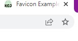
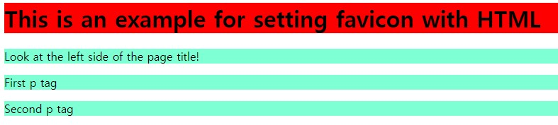
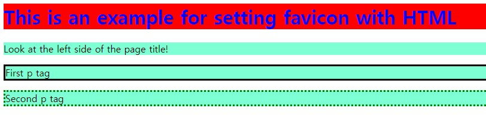
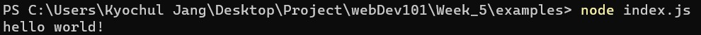
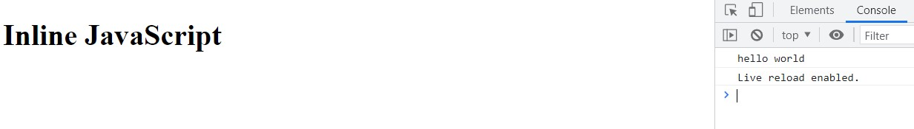

# Week 5

- [Recap](https://github.com/OfficerChul/webDev101/blob/main/Week_5/Week_5.md#-recap)
- [This Week](https://github.com/OfficerChul/webDev101/blob/main/Week_5/Week_5.md#-this-week)
- [HTML](https://github.com/OfficerChul/webDev101/blob/main/Week_5/Week_5.md#-html)
- [CSS](https://github.com/OfficerChul/webDev101/blob/main/Week_5/Week_5.md#css)
- [JavaScript](https://github.com/OfficerChul/webDev101/blob/main/Week_5/Week_5.md#javascript)
- [javaScript Programming](https://github.com/OfficerChul/webDev101/blob/main/Week_5/Week_5.md#javascript-programming)
- [Exercise](https://github.com/OfficerChul/webDev101/blob/main/Week_5/Week_5.md#-exercise)

## 🔙 Recap

- Comment / Annotation
- HTML - Attribute
- CSS - Intro to CSS

## 📖 This Week

- HTML
    - Favicon
    - Class Attribute
- CSS
    - Applying style to each element
- JavaScript - Intro to JavaScript
    - The HTML `<script>` Tag
    - Inline `script.js`

## 🦴 HTML

### Favicon

#### What is Favicon?

```
Favicon is a small icon which is displayed next to the page title.
```
ex) <br />


#### How to add Favicon in the website?
1. Create a directory called `images` in the root directory of the website folder.
2. Move the favicon image called `favicon.ico` to the `images` directory.
3. Link the `ico` file to the HTML file by using `link` tag. <br />
ex) <br />
`favicon_class_example.html`

```
<!DOCTYPE html>
<html>
<head>
  <title>Favicon Example</title>
  <link rel="icon" type="image/x-icon" href="../images/favicon.ico" />
  <link rel = 'stylesheet' href="style.css" />
</head>
<body>

<h1 class = 'header_tag'>This is an example for setting favicon with HTML</h1>
<p>Look at the left side of the page title!</p>
<p class = 'firstP'>First p tag</p>
<p class = 'secondP'>Second p tag</p>

</body>
</html>
```
like this <br />


#### How to make a custom favicon?
- Favicon should have a size of 16 pixels width and height.
- Favicon should be clean and simple.
- Favicon should be able to identificable which provides good visual indicator.

> Use [this website](https://favicon.io/) for converting images with various extension to `ico` extension.

### Class Attribute
```
- Used for specify the HTML element.
- Used for CSS to change the specified element.
```
ex)

`favicon_class_example.html`

```
<!DOCTYPE html>
<html>
<head>
  <title>Favicon Example</title>
  <link rel="icon" type="image/x-icon" href="../images/favicon.ico" />
  <link rel = 'stylesheet' href="style.css" />
</head>
<body>

<h1 class = 'header_tag'>This is an example for setting favicon with HTML</h1>
<p>Look at the left side of the page title!</p>
<p class = 'firstP'>First p tag</p>
<p class = 'secondP'>Second p tag</p>

</body>
</html>
```

## CSS

### Applying style to elements, separately
```
You can apply different styles to elements with the same tag by using "class" attribute and specifying that class name in css file.
```

`style.css`

```
h1 {
    background-color: red;
}

.header_tag {
    color: blue;
}

.firstP {
    border-style: solid;
    border-color: black;
}

.secondP {
    border-style: dotted;
    border-color: green;
}

p {
    background-color: aquamarine;
}
```

Without using class attribute



With using class attribute



## JavaScript 
> (`S` in JavaScript is uppercase.)

<p align='center' ></p>

```
JavaScript is a programming language that allows you to implement complex features on web pages.
```

### What is JavaScript used for?
- **Adding interactive behavior to web pages**
- Creating Web or Mobile apps
- Game development
- Building web servers and developing server applications

### Then, what is Programming?
```
Computer programming is the process of performing a particular computation, usually by designing and building an executable computer program.

-Wikipedia
```                                        
HTML and CSS are not the programming language, but JavaScript.

## JavaScript Programming

### Setting Environment
1. `node.js`
2. `Internet Browser (Console)`


### JavaScript with `node.js`

```
Node.js is a runtime built on Chrome's V8 JavaScript engine.
```
*runtime = environment (simple def)

ex )
NPM stands for Node Package Manager.
React.js use Node.js, so we will use `NPM` command for React.js

1. Install node.js
> Go to [download](https://nodejs.org/en/download/)

2. Run `Command Line(Terminal)`

3. Go to the directory which has the `.js` file

4. Execute the `.js` program by using `node` command
>syntax -> `node` [filename]

5. `script.js` is the common name for JavaScript file.<br />

ex)
`script.js`
```
console.log("hello world!")
```


### JavaScript with `Web Browser`
You can run JavaScript code without installing VsCode.

ex)
`js_inline_example.html`

```
<!DOCTYPE html>
<html>
<head>
  <title>Favicon Example</title>
  <link rel="icon" type="image/x-icon" href="../images/favicon.ico" />
</head>
<body>

<h1 class="head">Inline JavaScript</h1>
  <script>
    console.log('hello world');
  </script>

</body>
</html>
```

1. Write the JavaScript code
2. `Go Live`
3. Go to `inspect`
4. Go to `Console`

<br />




## 🏠 [Exercise](https://github.com/OfficerChul/webDev101/blob/main/Week_5/exercise/instruction.md)