# Week 9

- [Recap](https://github.com/OfficerChul/webDev101/blob/main/Week_9/Week_9.md#-recap)
- [This Week](https://github.com/OfficerChul/webDev101/blob/main/Week_9/Week_9.md#-this-week)
- [CSS - Position](https://github.com/OfficerChul/webDev101/blob/main/Week_9/Week_9.md#-css---position)
- [React.js](https://github.com/OfficerChul/webDev101/blob/main/Week_9/Week_9.md#-reactjs)
- [React Component](https://github.com/OfficerChul/webDev101/blob/main/Week_9/Week_9.md#-react-component)
- [Future Plans](https://github.com/OfficerChul/webDev101/blob/main/Week_9/Week_9.md#%EF%B8%8F-future-plans)
- [Exercise](https://github.com/OfficerChul/webDev101/blob/main/Week_9/Week_9.md#-exercise)

## 🔙 Recap

- CSS - Grid
- React.js - Set Up Development Environment

## 📖 This Week

- CSS
    - Position
        - static
        - relative
        - absolute
        - fixed
- React.js
- React Component
- Future Plans

## 🧶 CSS - Position

### What is Position?

```
Position property how the elements will be positioned on the screen.
There are four types of position.
- Static
- Relative
- Absolute
- Fixed
```

### Static
```
The element with position `static` is positioned as the normal flow of the code.
`top`, `left`, `bottom`, and `top` properties will not work with the `static` position.
```

<p align='center'>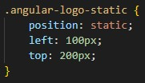</p>

<p align='center'>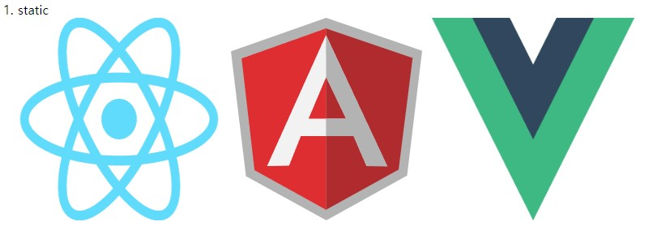</p>

### Relative
```
The element with position `relative` is positioned as the normal flow of the code 
with applying `top`, `left`, `bottom`, and `top` properties from the offset.
```

<p align='center'>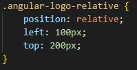</p>

<p align='center'>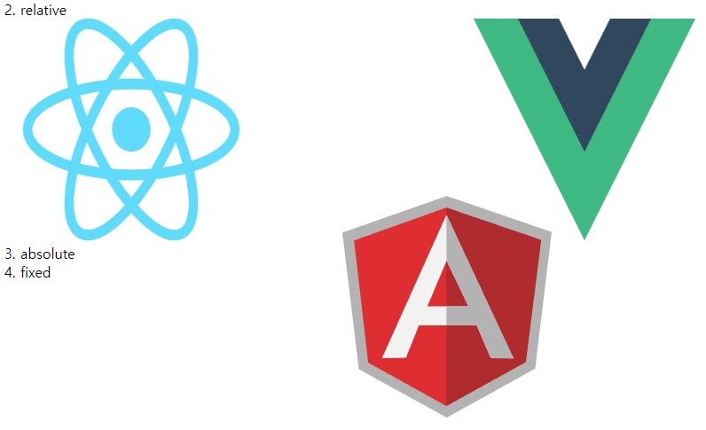</p>

### Absolute
```
The element with position `absolute` doesn't follow the normal flow of the code.
`top`, `left`, `bottom`, and `top` properties affects the final position of the element.
```

<p align='center'>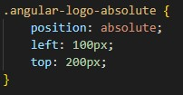</p>

<p align='center'>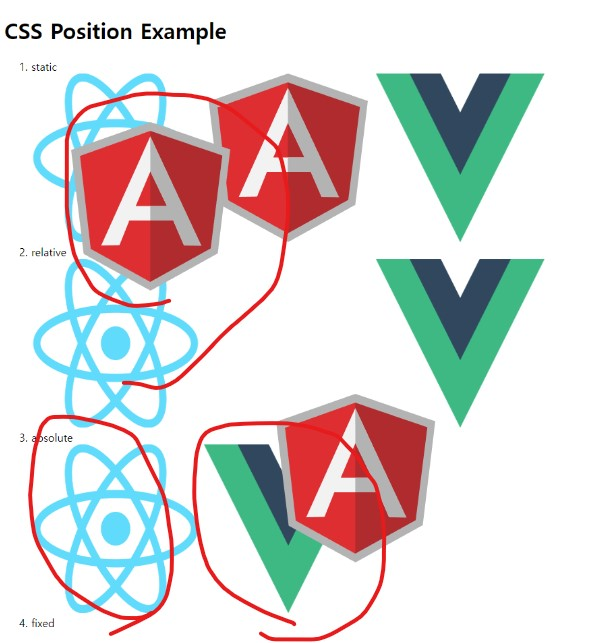</p>

### Fixed
```
The element with position `fixed` doesn't follow the normal flow of the code.
Just think that the element will be fixed on your screen, not on the website.
```

<p align='center'>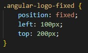</p>

https://user-images.githubusercontent.com/35318639/179258623-e4d11f2d-a608-44ad-acd8-e9a85d5f44f3.mp4

### Example

`position.html`
```
<!DOCTYPE html>
<html>
    <head>
        <title>CSS - Postion Example</title>
        <link rel='stylesheet' href="position.css"></link>
    </head>
    <body>
        <header>
            <h1>CSS Position Example</h1>
            <ol>
                <li>static</li>
                    
                    
                    
                <li>relative</li>
                    
                    
                    
                <li>absolute</li>
                    
                    
                    
                <li>fixed</li>
                    
                    
                    
            </ol>
        </header>
    </body>
</html>
```

`position.css`
```
img {
    width: 250px;
    height: 250px;
}

.angular-logo-static {
    position: static;
    left: 100px;
    top: 200px;
}

.angular-logo-relative {
    position: relative;
    left: 100px;
    top: 200px;
}

.angular-logo-absolute {
    position: absolute;
    left: 100px;
    top: 200px;
}

.angular-logo-fixed {
    position: fixed;
    left: 100px;
    top: 200px;
}
```
## 🧔 React.js

<p align='center'></p>

### What is React?

React is a declarative, efficient JavaScript Library (Framework) for building user interface. This helps you to build your website by stacking a very small block of code called `components`.

### Why React?

1. Component Based Developement (Feat. Lego)
    - Each component that you built can be reused.
    - It makes web dev much easier and flexible.
    
2. JSX (JavaScript + XML)
    - It allows you to use HTML-like element in the JavaScript.
    - Can learn faster than other frameworks such as Angular and Vue.

`App.js`
```
function App() {
  return (
    <div className="App">
      <header className="App-header">
        
        <p>
          Edit <code>src/App.js</code> and save to reload.
        </p>
        <a
          className="App-link"
          href="https://reactjs.org"
          target="_blank"
          rel="noopener noreferrer"
        >
          Learn React
        </a>
      </header>
    </div>
  );
}
```
3. Virtual DOM (Document Object Model)
    - React created a copy of DOM which keep tracks of only changes and updates the web site which made the process of loading website simplifier and faster.

### How to use it?

1. Make an empty page by removing every element in the outermost `div` tag.
<p align='center'>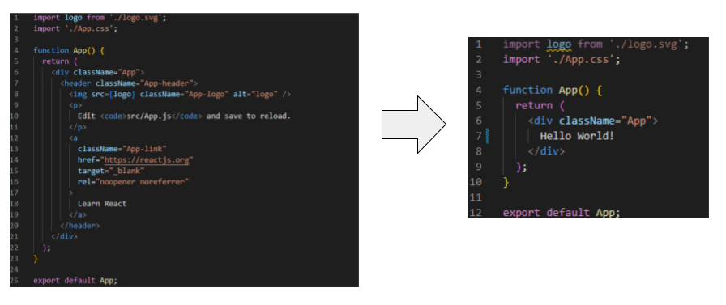</p>
</br>
Then, you will be able to see a blank page (exclude `Hello World!` context).
<p align='center'>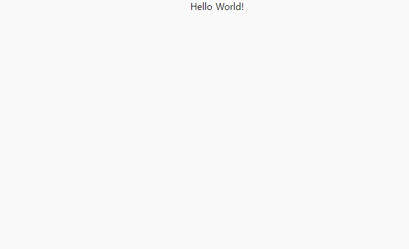</p>

2. You can write the same code (but not exactly the same) as the code of html file to this react file.
</br>
There are some different elements due to JSX react extension.
</br> For example, 
 - When you give a class name to a certain tag </br>

`html`:

```
<div class='html_tag'> 
</div>
```

`React`:
``` 
<div className='react_tag`>
</div>
```

But, put the expression outside of the `return` function.

> Don't forget to put `;` (semicolon) at the end of the statement.

## 🌄 React Component

### What is component
```
Component is a block of code that you can reuse in React.js.
This helps you write your code much faster.
Component is ussed as `tag` in React.
```

### For example...
The picture below is one `Line` component.
<p align='center'>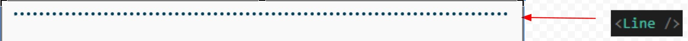</p>

I reused the `Line` component four times.
<p align='center'>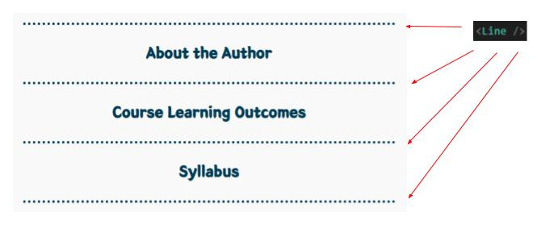</p>

### Lets look at the code!

<p align='center'>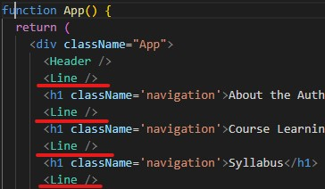</p>

### How to create and use `components`?

1. Create `components` in `src` folder.
2. In `src/components`, create a component folder that you want to use, for example, `Header`.
> The first letter of the component's name should always be a capital letter.
3. Create `Header.js` for React.js and `Header.css` for css file in `src/components/Header`.
<p align='center'>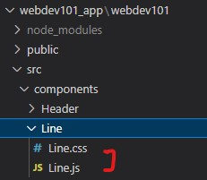</p>
4. Write code for the `js` file and the `css` file.

`React.js`
```
import React from 'react';
import './Line.css';

export default function Line() {
    return (
        <div>
            
            <hr className='line'/>
        </div>
    );
}
```

`css`
```
.line {
    
    border-top: 5px dotted #003C57;
    width: 40%;
    display: flex;
    justify-content: center;
    align-items: center;
    margin: auto;
    margin-top: 40px;
    margin-bottom: 40px;
}
```

5. Import the component to `App.js` which is the main React file
<p align='center'>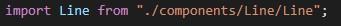</p></br>
and then use it in the `App()` function. </br>
<p align='center'></p> </br>
You will see </br>
<p align='center'></p>

### Types of components

#### Class Components vs Function Components

#### Class Components (Old Fashion)

1. It is a old way to make a component.
2. Slow, heavy and complicated.
3. Many old companies have a React code with `Class Component`.

```
import React, { Component } from 'react'

export default class Hello extends Component{
  render(){
    return(
      <div>
          Hello World!
      </div>
    )
 }
}
```

#### Function Components (New Fashion)

1. It is a new way to make a component.
2. Newcomers are using `Function Component`.
3. Simple and Fast.
4. It is getting famous and all companies are now using `Function Component`.

```
import React from 'react'

export default function Hello() {
  return (
     <div>
        Hello World!
    </div>
 )
}
```

## ⏲️ Future Plans

```
It's time to make your drawn website real!
You will build your own website by using `React.js`.
```

Take a look at the code in `webdev101_app` folder.
Enter `npm start` if you want to run react.

The following picture is the website that I am building. I will make this website when tutees make their own website using `react.js`.</br>
This website is a representative website of this class.

<p align='center'>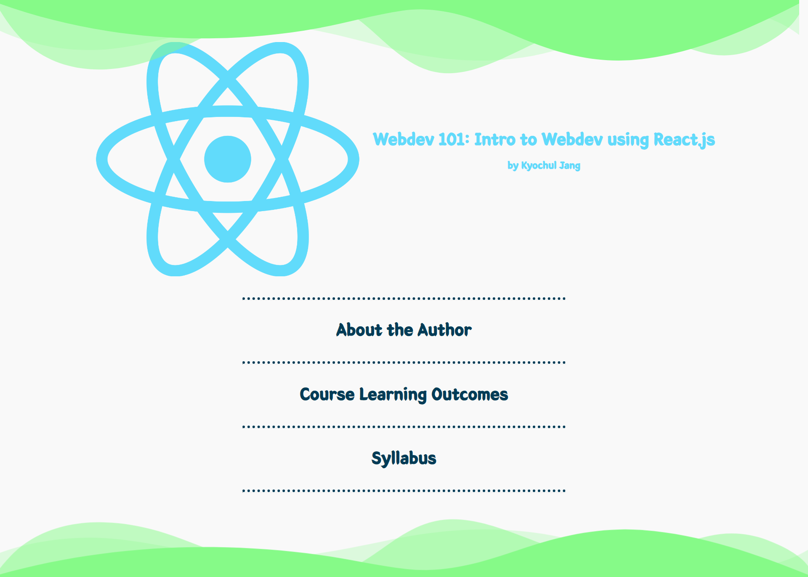</p>

For the rest of the class, you will learn
- How to solve problems on their own
- How to make website using react
  - How to utilize components
  - How CSS and JSX works exactly the same way as we did using CSS and HTML
  - How to give elements an animation
  - How to apply font using `ttf` file
  - How to use Router
- How to utilize design tools
 - shapedivider:
 https://www.shapedivider.app/
 - color palette:
 https://mycolor.space/
 - haikei:
 https://haikei.app/
 - coolbackgrounds:
 https://coolbackgrounds.io/
 - dribble:
 https://dribbble.com/ 
- How to deploy website and let others see

## 🏠 [Exercise](https://github.com/OfficerChul/webDev101/blob/main/Week_9/exercise/instruction.md)
