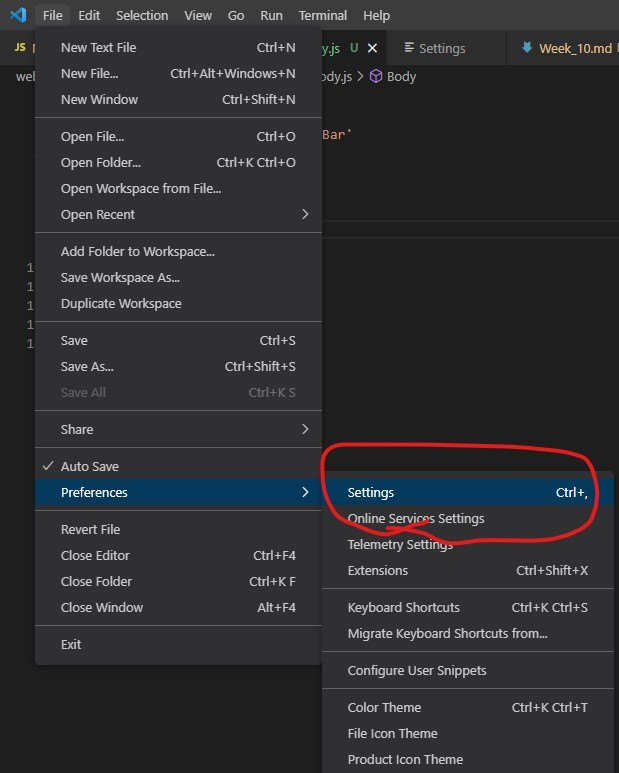
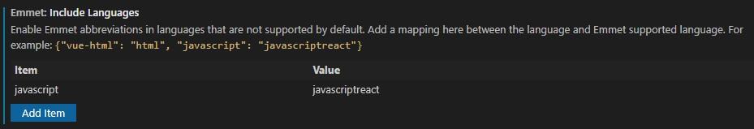
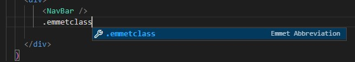
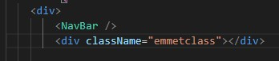

# Week \#

- [Recap]()
- [This Week]()
- [Exercise]()

## 🔙 Recap

## 📖 This Week

- VsCode
    - Emmet
- CSS 
    - hover
- React
    - Router
    - useState

## 🍇 VsCode - Emmet

### What is Emmet?

```
Emmet is a plugin for text editors and it improves the efficiency of typing code of CSS and HTML.

In VsCode, no extension is required.
```

### How to install?

1. Go to `File` > `Preference` > `Settings`
<p align='center'></p>

2. Go to `Emmet: Include Languages`
<p align='center'></p>

3. Try type `<div className='...'></div>` by using `.` following by classname
<p align='center'></p>

4. It works!
<p align='center'></p>

> Go to [Emmet Official Website](https://emmet.io/) for more information!

## ✍️ CSS - Hover

### What is hover?

### How to use it?

### Example

## 🏠 Exercise