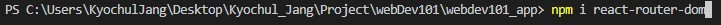
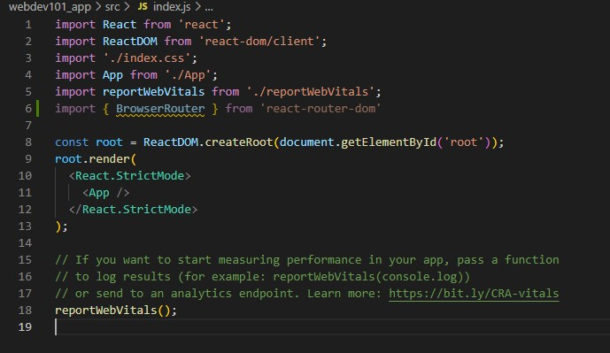
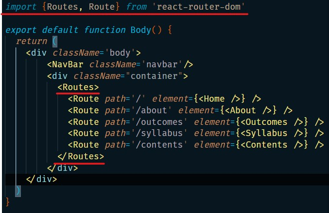
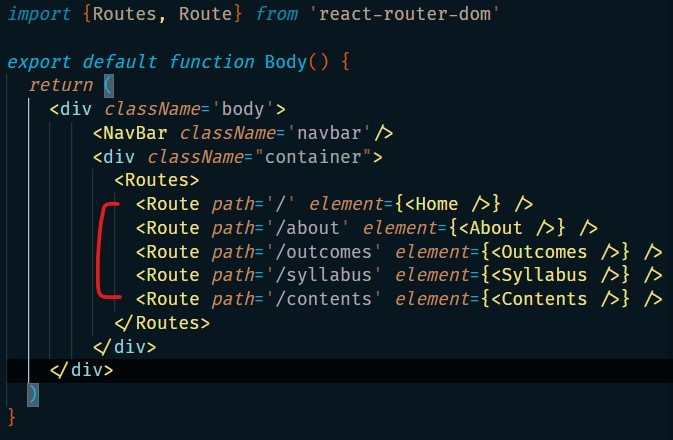
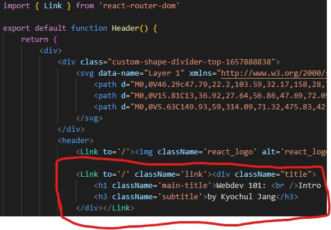
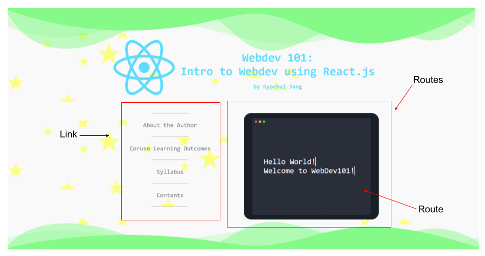
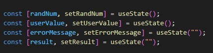

# Week 10

- [Recap]()
- [This Week]()
- [Exercise]()

## 🔙 Recap

## 📖 This Week

- VsCode
    - Emmet
- CSS 
    - hover
- React
    - Router
    - useState

## 🍇 VsCode - Emmet

### What is Emmet?

```
Emmet is a plugin for text editors and it improves the efficiency of typing code of CSS and HTML.

In VsCode, no extension is required.
```

### How to install?

1. Go to `File` > `Preference` > `Settings`
<p align='center'></p>

2. Go to `Emmet: Include Languages`
<p align='center'></p>

3. Try type `<div className='...'></div>` by using `.` following by classname
<p align='center'></p>

4. It works!
<p align='center'></p>

> Go to [Emmet Official Website](https://emmet.io/) for more information!

## ✍️ CSS - Hover

### What is hover?

```
The hover effect happens when the user hovers over an element, for example hover mouse pointer to the elements.
```

### How to use it?

```
[elements]:hvoer {
    [css effects]
}
```

### Example

`hover.html`
```
<!DOCTYPE html>
<html>
    <head>
        <title>CSS - Hover Example</title>
        <link rel='stylesheet' href="style.css"></link>
    </head>
    <body>
        Hover a mouse pointer on the picture<br/>
        

    </body>
</html>
```

`hover.css`

```
.python-logo {
    padding-top: 50px;
    width: 250px;
    transition: ease 1s;
}

.python-logo:hover {
    transform: translateY(100px);
    filter: grayscale(100%);
}
```

## 🟨 React - Router

### What is Router?

```
Router is a standard library for routing several pages in react. Router only updates the portion that you want to update.

This can replace the `anchor` tag in html.
```
> `anchor` tag updates the whole page if you want to change. But, router function in react only updates the portion that you want to change.

### How to use it?

0. Install `react-router-dom` by using the following command:
<p align='center'></p>

1. Import `BrowserRouter` from `react`

```
import { BrowserRouter } from `react`
```
Wrap all the codes that you use in this project.

<p align='center'></p>

> If you want more information about `BrowserRouter`, please click [here](https://www.geeksforgeeks.org/reactjs-router/#:~:text=React%20Router%20is%20a%20standard,in%20sync%20with%20the%20URL.).

2. Import `Routes`, and`Route` from `react`

```
import { Routes, Route } from `react`
```

and wrap the portion of the code that you want to change with `Routes`.

<p align='center'></p>

Now, you set that only the wrapped portion will be changed from the browser. This boosts the efficiency of the website.

3. Put the components in `<Routes>` tag that you want to be navigated using `<Route>` tag.

```
<Route path='/' element={<[component-name] />} />
```

<p align='center'></p>

4. Go to the component which you have the `button` for routing. In my case, it is `<NavBar>` component and `<header>` component.
<br />
<br />

5. Make a hyperlink by using `<Link>` tag from `react.

<p align='center'></p>

> If this process confuses you, think it as
> `Link` is to make a link and apply it to the included elements.
> `Route` is to route your current website to the matching link

### Summary

<p align='center'></p>

## React - useState

### What is useState?
```
useState is a type of React Hook which allows you to change the state by tracking the state.
```

### How to use it?
<p align='center'></p>

#### Syntax
```
const [[variable], set[variable]] = useState([initial value]);
```

### For example
```
const [number, setNumber] = useState(0); // number = 0

setNumber(3); // number = 3
setNumber(5); // number = 5
```

### Application
```
const [number, setNumber] = useState(0);

const addNumber = () => {
    setNumber(number + 1);
}

return (
    <>
        <button onClick={addNumber}>add Number</button>
        <h1>{number}</h1>
    </>
)
```


## 🏠 Exercise