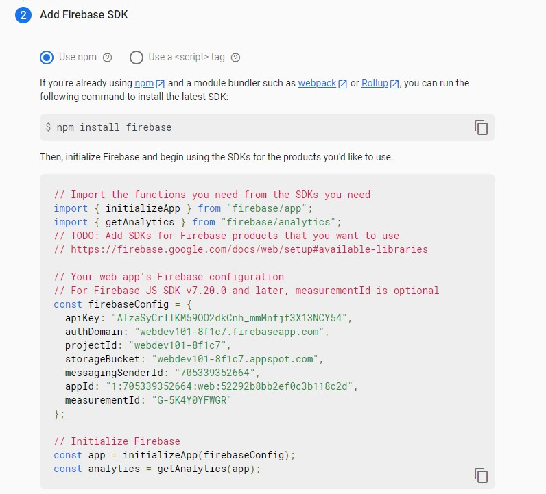

# Week 11

- [Recap](https://github.com/OfficerChul/webDev101/blob/main/k_Week_11/Week_11.md#-recap)
- [This Week](https://github.com/OfficerChul/webDev101/blob/main/k_Week_11/Week_11.md#-this-week)
- [Firebase](https://github.com/OfficerChul/webDev101/blob/main/k_Week_11/Week_11.md#-firebase)
- [Vite](https://github.com/OfficerChul/webDev101/blob/main/k_Week_11/Week_11.md#%EF%B8%8F-vite)
- [UseState](https://github.com/OfficerChul/webDev101/blob/main/k_Week_11/Week_11.md#0%EF%B8%8F%E2%83%A3-react---usestate)
- [Exercise](https://github.com/OfficerChul/webDev101/blob/main/k_Week_11/Week_11.md#-exercise)

## 🔙 Recap

- VsCode
    - Emmet
- CSS 
    - Hover
- React
    - Router

## 📖 This Week

- React
    - UseState
- Firebase
- Vite

## 🔥 Firebase

### What is Firebase?

```
Firebase is a Software as a Service(SaaS) that is a Google's platform which helps you develop mobile and web applications.

- It was an independent company founded in 2011, but acquired by Google in 2014.
- Firebase is the most popular SaaS and has the biggest SaaS community. Thanks to Google, it is keep developing.

```

### Why Firebase?
```
It provides backend service for free (almost), for example, authentication, cloud storage, cloud messaging, and so on.

- If you exceed the limit, then you need to pay money.
```

### When to use Firebase?
```
Since Firebase service is for convenience of backend from Google, you will loose your control on backend, for example, data management. But, as your service get larger, you will need more control on your backend.

If you want to make a prototype of the service that you want to launch, use Firebase. This will allows you to save your time to test out your service.
```

### How to use it?

1. Go to the [Firebase](https://firebase.google.com/) website

<p align='center'></p>

2. Press `Get started` to start your project and create your project

<p align='center'></p>
<p align='center'></p>

3. Click the web icon and Add Firebase SDK to your project

<p align='center'></p>

<p align='center'></p>

> SDK is a abbreviation for Software Development Kit which is a collection of software development tools such as compilers, debugger, or software framework.


Type `npm install firebase` to install firebase

## 🌩️ Vite

### What is Vite?
```
Vite is a bundling build tool which makes your development faster.

There was bundling tools before Vite, such as Webpack. However, now, Vite is the fastested bundling tool and also it is easy to create react app.
```
> [This link](https://vitejs.dev/) for more info

### How to install?
```
# npm v6.x
npm create vite@latest [my-react-app] --template react

# npm v7+, extra double-dash is needed:
npm create vite@latest [my-vue-app] -- --template react
```
> You can check npm version by pressing `npm -v` on your command line.

After you install, you can use however you want as when you use plain React.

## 0️⃣ React - useState

### What is useState?
```
useState is a type of React Hook which allows you to change the state by tracking the state.
```

### How to use it?

```
import { useState } from 'react'
```

<p align='center'></p>

#### Syntax
```
const [[variable], set[variable]] = useState([initial value]);
```

### For example
```
const [number, setNumber] = useState(0); // number = 0

setNumber(3); // number = 3
setNumber(5); // number = 5
```

### Application
```
const [number, setNumber] = useState(0);

const addNumber = () => {
    setNumber(number + 1);
}

return (
    <>
        <button onClick={addNumber}>add Number</button>
        <h1>{number}</h1>
    </>
)
```

<p align='center'></p>

## 🏠 [Exercise](https://github.com/OfficerChul/webDev101/blob/main/k_Week_11/exercise/instruction.md#exercise-instruction)