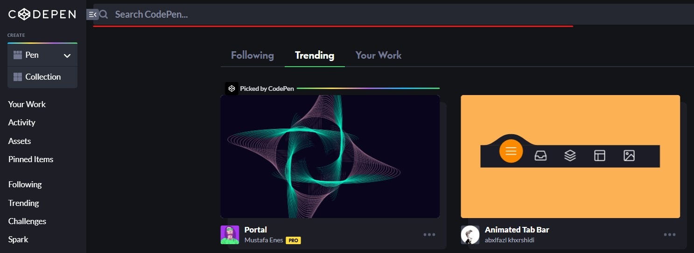
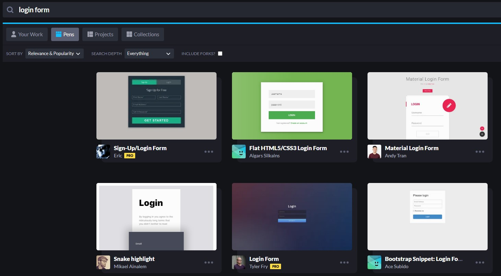
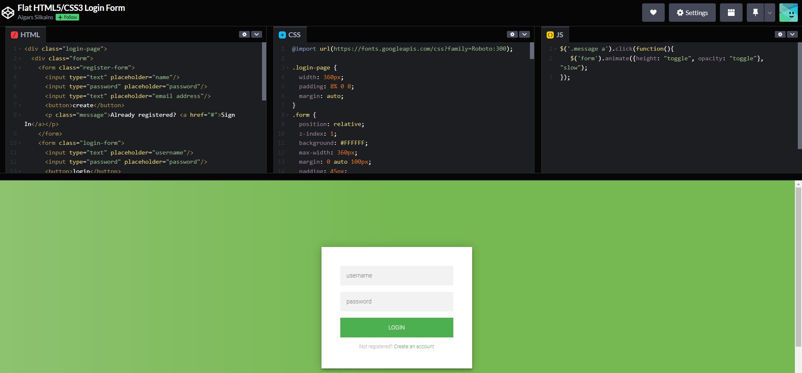

# Week 12

- [Recap]()
- [This Week]()
- [Exercise]()

## 🔙 Recap
- React
    - UseState
- Firebase
- Vite

## 📖 This Week

- CSS tools
    - Bootstrap
    - Codepen
- Deploy Website

## 👩‍🔬 CSS Tools

### Bootstrap

#### What is Bootstrap

```
Bootstrap is a CSS framework for developing responsive and mobile-first websites.

Bootsrap 5 is the newest version of Bootstrap.
```

> For more information, this [link](https://react-bootstrap.github.io/getting-started/introduction/)

#### How to install and use it?

1. If you are using npm, type to install react-bootstrap
```
npm install react-bootstrap bootstrap
```

2. Import the css file from the installed bootstrap

```
import 'bootstrap/dist/css/bootstrap.min.css';
```

> You only need to import the bootstrap `.css` file only once in your project. If you don't install the `.css` file, the styling will not be working.

3. Import the component that you want to utilize from bootstrap. In this case, I am importing Button from `react-bootstrap`.

```
import { Button } from 'react-bootstrap';
```

You can check out more various components from [this link](https://react-bootstrap.github.io/components/alerts/)

4. You can add a button with design using just one line of code.
```
<Button variant='info'>Test</Button>
```

If you want to change the design, you can add change `variant`.
<p align='center'></p>

In bootstrap, you will use `className` to change the styling, not the `css` file that you made.

> There are a lot of other functions than variant. You need to Google it.

4. Then this button will be added in your websitev

<p align='center'></p>

### Codepen

#### What is Codepen

```
CodePen is a social development environment for front-end designers and developers.

Many developers shared their web style and degin on the platform which you can use.
Most projects in the codepen is using MIT Licensed.
```

#### How to install and use it?
```
You don't have to install anything to use the projects in codepen.

You just need to copy the code from one of the codepen projects and make changes according to your projects.
```

1. Search any design you want
<p align='center'></p>

2. Choose any projects
<p align='center'></p>

3. Copy HTML, CSS, JavaScript codes from the codepen and paste them into your project.
<p align='center'></p>

## Deploy Webstie


## 🏠 Exercise